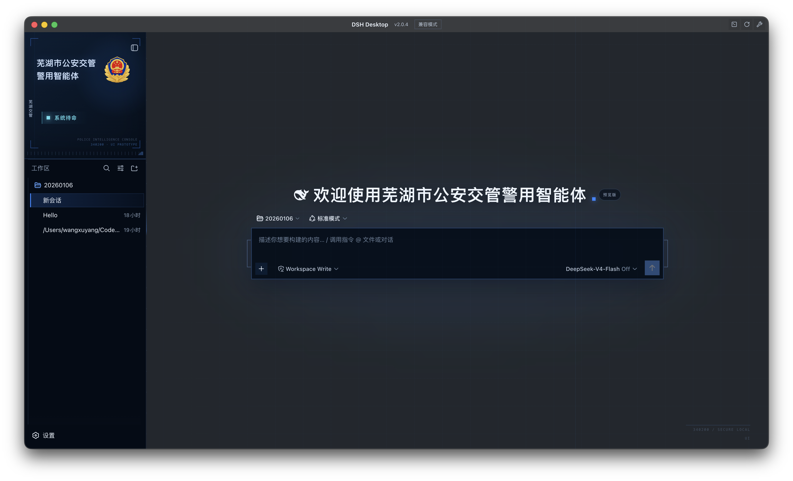

# 芜湖交管警用智能体皮肤

这是一个可加载到 DSH Desktop 的 Web Client 皮肤。它只修改现有界面的品牌、色彩、排版和装饰，并把当前会话状态显示为中文状态标签。



## 功能边界

皮肤负责：

- 芜湖市公安交管品牌区、徽标和页面标题
- 深蓝配色、直线边框、排版和装饰刻度
- 空态欢迎语和当前会话状态的视觉投影
- Settings 打开时的层级兼容
- 卸载时恢复 DOM、属性、标题、favicon、观察器和样式变量

任务看板、SSH、技能中心、插件市场、工作区树、会话列表、模型选择器和消息发送仍由 DSH 或其他插件提供。本包不创建这些功能，也不绑定它们的业务逻辑。

## 环境要求

- Node.js `^22.19.0` 或 `>=24.0.0`
- Corepack
- pnpm `11.25.0`，由 `packageManager` 字段锁定

## 构建与检查

```sh
corepack pnpm install --frozen-lockfile
corepack pnpm run check
```

`check` 依次运行 TypeScript 检查、Vitest 和构建。构建会生成并提交以下文件：

- `lib/index.js`
- `lib/client.js`
- `skin.build.json`

`skin.build.json` 由 `scripts/write-skin-build.mjs` 生成，仓库路径固定为 `.`。不要手工修改 fingerprint。

## 本地安装

DSH CLI 必须使用皮肤仓库的绝对路径：

```sh
dsh plugin --profile desktop add /absolute/path/to/dsh-skin-wuhu-traffic-agent
```

同名包从旧路径迁移时直接再次执行 `plugin add`，不要先 remove。安装后确认 `ui-skin-wuhu-traffic-agent` 启用，并显式禁用其他皮肤。配置支持热加载时刷新页面即可。

## 兼容性

`skin.json.dshCompatibility` 保持为 `0.1.1rc2`，这是当前构建元数据接受的稳定 rc 格式。2026-09-01 已在 DSH Desktop 2.0.4 所带的 `0.1.2-alpha.1` 运行时完成真实启动验证。

皮肤使用 DSH 的既有 Settings dialog，不替换其 mask、焦点管理或业务结构。皮肤自有层级保持低于 DSH 的 Modal 1000 和 portal menu 1100。

## 素材与许可

本项目沿用 ORCA LINK 的 CC BY-NC-SA 4.0 许可，只允许非商业使用。来源和修改说明见 [NOTICE](NOTICE)。

`assets/police-emblem-hd.png` 是用户提供的 `1254 × 1254` 原图。客户端使用由它生成的 `512 × 512` 版本 `assets/police-emblem-runtime.png`，并以内嵌数据 URI 加载，不依赖远程资源。

该许可不授予公安徽标相关的官方标志、商标或背书权利。公开分发或投入实际业务前必须确认素材使用授权。
